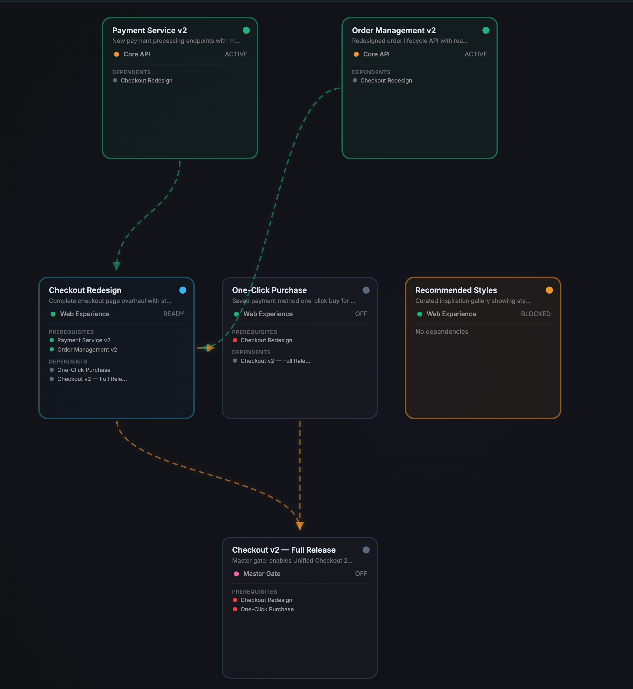
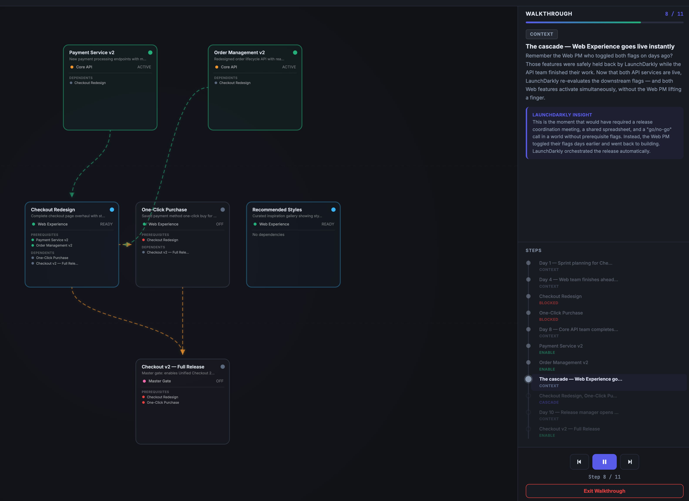
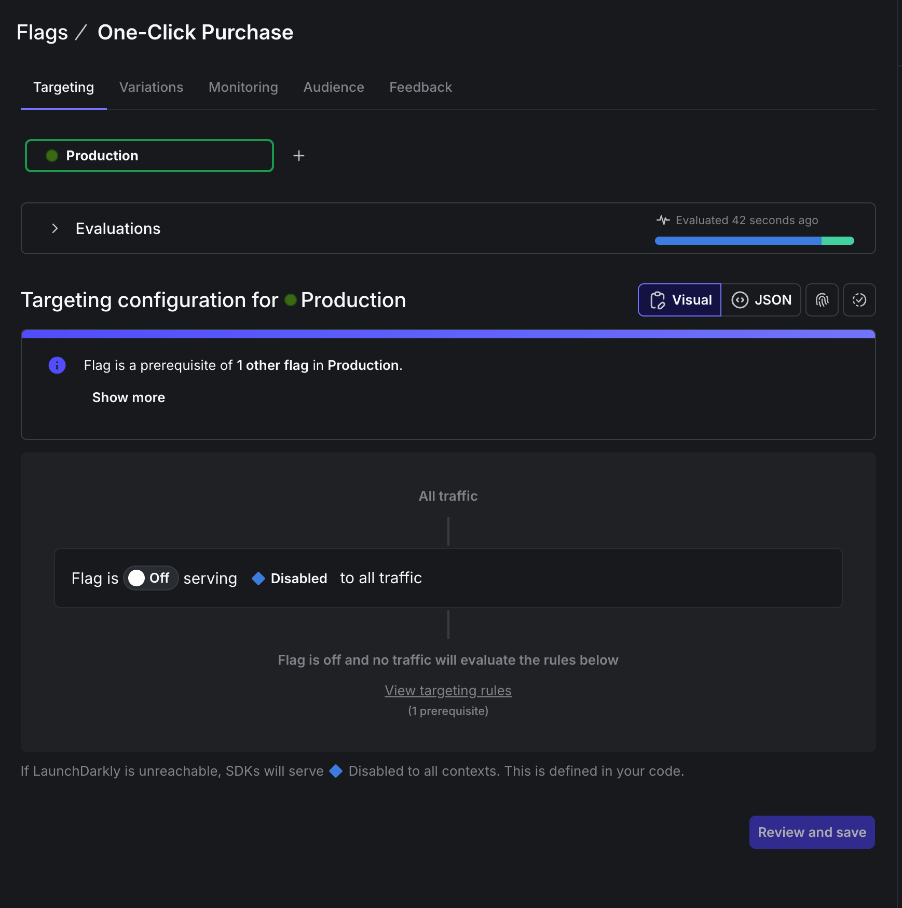

# LaunchDarkly Prerequisite Flag Orchestration Demo

An interactive dependency graph that visualizes how **LaunchDarkly prerequisite feature flags** coordinate multi-team software releases. Toggle flags on and off and watch dependencies cascade through the graph in real time.



---

## What This Demo Shows

Enterprise releases often span multiple teams and services. A frontend checkout redesign can't go live until the backend payment API is ready. A one-click purchase flow depends on the checkout redesign being stable. A master release gate shouldn't open until every component is verified.

**LaunchDarkly prerequisite flags** encode these dependency relationships directly into flag configuration:

- A flag **cannot evaluate to true** until all its prerequisites are met
- Disabling an upstream flag **automatically blocks** everything downstream
- Teams work independently while the system enforces release order
- A master release gate aggregates readiness across the entire feature surface

This demo makes that concept visual and interactive.

> **Internal context**: For background on why this demo was built and how it fits into the sales motion, see the [Why It Matters — Confluence post](https://launchdarkly.atlassian.net/wiki/spaces/~71202067804d09ac24451fa80aaa218ed0cbfa/pages/4720984174/LaunchDarkly+Feature+Flag+Orchestration+Demo+for+Coordinated+Software+Releases) (LaunchDarkly team only).

---

## Setup

**Requirements**: Node.js 18+ and npm.

### 1. Install dependencies

```bash
npm install
```

### 2. Configure environment

```bash
cp .env.example .env
```

Edit `.env` with your LaunchDarkly credentials:

| Variable | When needed | Description |
|----------|-------------|-------------|
| `LD_API_KEY` | Setup + live mode | REST API access token (starts with `api-`). Create at [Settings → Authorization](https://app.launchdarkly.com/settings/authorization). Required for `setup-flags` and bidirectional sync. |
| `LD_PROJECT_KEY` | Setup + live mode | Your LaunchDarkly project key. Find at Project Settings. |
| `LD_ENVIRONMENT_KEY` | Setup + live mode | Target environment (default: `production`) |
| `LD_SDK_KEY` | Live mode only | Server-side SDK key (starts with `sdk-`). Omit to use simulation mode — no LD account needed. |
| `LD_CLIENT_SIDE_ID` | Optional | Client-side ID for browser SDK features (observability, session replay on the shop page) |
| `PORT` | Optional | Server port (default: `3000`) |

> **Simulation mode**: If you just want to try the demo without a LaunchDarkly account, skip steps 2–3 entirely and go straight to `npm start`. The app runs with an in-memory simulation that mirrors prerequisite behavior.

### 3. Create flags in LaunchDarkly

If using live mode, run the setup script to create all flags with prerequisite relationships:

```bash
npm run setup-flags
```

This creates 6 boolean flags in your project:

| Flag Key | Name | Team | Prerequisites |
|----------|------|------|---------------|
| `api-payment-service-v2` | Payment Service v2 | Core API | — |
| `api-order-management-v2` | Order Management v2 | Core API | — |
| `web-checkout-redesign` | Checkout Redesign | Web Experience | Payment Service v2, Order Management v2 |
| `web-one-click-purchase` | One-Click Purchase | Web Experience | Checkout Redesign |
| `web-recommended-styles` | Recommended Styles | Web Experience | — |
| `release-checkout-v2` | Checkout v2 — Full Release | Release Gate | Checkout Redesign, One-Click Purchase |

### 4. Start the server

```bash
npm start
```

Open [http://localhost:3000](http://localhost:3000) — this loads the dependency graph.

In **live mode** (with `LD_SDK_KEY` + `LD_API_KEY`), flags sync bidirectionally — toggle in the graph and see it reflected in the LD dashboard, or toggle in LD and see the graph update.

---

## The Dependency Graph



### Flag Cards

Each flag is rendered as a card showing:
- **Status**: ACTIVE (green), BLOCKED (amber), READY (blue), OFF (gray)
- **Team**: Color-coded team affiliation
- **Prerequisites**: Listed with met/unmet indicators
- **Dependents**: What downstream flags this flag gates

### Link Colors

| Color | Meaning |
|-------|---------|
| Green | Prerequisite is met — downstream path is unblocked |
| Orange | Prerequisite is not met — blocking the downstream flag |
| Red | Broken dependency — downstream is ON but upstream is OFF |

### Controls

- **Sidebar → Controls tab**: Toggle individual flags on/off
- **Click a node**: View details and toggle from the detail panel
- **Animate Rollout**: Step-by-step narrated walkthrough of the release sequence
- **Reset / Enable All**: Quick actions to reset or activate all flags

### Dependency Chain

```
api-payment-service-v2 ──────┐
                              ├──► web-checkout-redesign ──► web-one-click-purchase ──┐
api-order-management-v2 ──────┘                                                       ├──► release-checkout-v2
                                                          web-one-click-purchase ──────┘

web-recommended-styles (standalone)
```

---

## How Prerequisite Flags Work

In LaunchDarkly, a **prerequisite** is a flag that must be ON and serving a specific variation before a dependent flag can evaluate its own targeting rules. If the prerequisite isn't met, the dependent flag returns its off-variation.



This demo mirrors that behavior:

1. Each flag tracks `enabled` (targeting ON) and `effective` (enabled AND all prerequisites met)
2. Toggling a flag ON is blocked if any prerequisite is still OFF
3. Toggling a flag OFF cascades — all downstream dependents are automatically blocked
4. The release gate only becomes effective when both checkout redesign and one-click purchase are active

---

## Code References (Optional)

To link flag keys in your codebase to the LaunchDarkly dashboard:

**GitHub Actions** (automatic on push):
1. In your GitHub repo, add these under Settings → Secrets and variables → Actions:
   - Secret: `LD_ACCESS_TOKEN` — your `LD_API_KEY` value
   - Variable: `LD_PROJECT_KEY` — your project key
2. Push to `main` — the workflow runs automatically

**Manual** (local):
```bash
brew tap launchdarkly/tap && brew install ld-find-code-refs
LD_ACCESS_TOKEN=api-xxxx ld-find-code-refs \
  --dir=. \
  --projKey=your-project-key \
  --repoName=Orchestration
```

---

## Additional Pages (Hidden)

The project includes three additional pages that are not linked from the main navigation but are still accessible by URL. These can be useful for extended demos:

| Page | URL | Description |
|------|-----|-------------|
| Release Dashboard | `/index.html` | Team-organized cards with flag toggles, prerequisite badges, staged rollout, and activity log |
| Demo App | `/demo.html` | Technical mock showing checkout components that respond to flag state |
| VERDE+ Shop | `/shop.html` | Fully designed storefront with flag-driven UI (checkout redesign, one-click purchase, recommended styles), user context switching for targeted flags, and LaunchDarkly observability/session replay integration |

---

## Project Structure

```
├── server.js              # Express server — API routes, LD SDK integration
├── setup-ld-flags.js      # Creates flags + prerequisites in LD via REST API
├── public/
│   ├── viz.html            # Dependency graph (main page)
│   ├── data.js             # Shared data layer (server or client-side)
│   ├── styles.css          # Shared navigation styles
│   ├── index.html          # Release dashboard
│   ├── demo.html           # Technical demo page
│   └── shop.html           # Mock storefront (flag-driven UI, observability)
├── .env.example            # Environment variable template
├── .github/workflows/      # GitHub Actions for code references
└── .launchdarkly/          # Code references config
```

---

## Tech Stack

- **Node.js + Express** — API server with optional LaunchDarkly SDK
- **LaunchDarkly Node Server SDK** — server-side flag evaluation (streaming)
- **D3.js v7** — dependency graph visualization
- **Vanilla HTML/CSS/JS** — no framework dependencies
